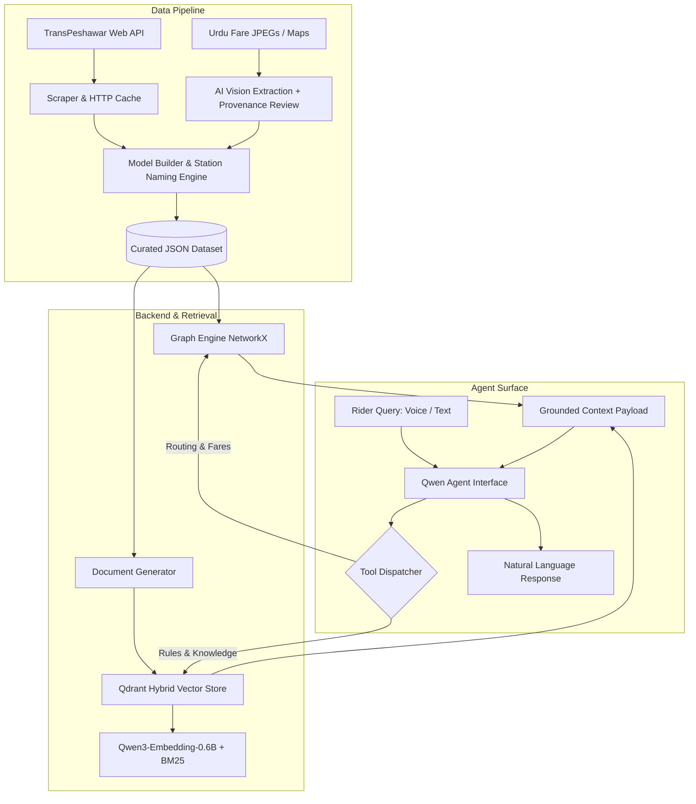

# ZuRehbar (زو رہبر) — Comprehensive Pitch Deck & Project Overview

> **An AI-Powered Multilingual Voice & Text Assistant for Peshawar BRT (Zu Peshawar) Commuters**  
> *"The deterministic graph engine calculates what is true; Qwen LLM phrases how it is spoken."*

---

## Executive Summary

**ZuRehbar** (meaning *"Zu Guide"*) is an intelligent, voice-first transit assistant designed specifically for the **Zu Peshawar** Bus Rapid Transit (BRT) network operated by TransPeshawar. Serving over 250,000 daily commuters across 19 routes and dozens of stations, the network can be daunting for riders—especially when navigating complex multi-leg journeys requiring 2 to 3 transfers.

While TransPeshawar publishes raw timetables and static web pages, it provides **no trip planner, transfer guide, or distance fare calculator**. Furthermore, public information is fragmented and contradictory: fare tables exist only within Urdu image files, route distances are unlisted, and timetables are missing for multiple feeder routes.

ZuRehbar solves this by pairing a **deterministic graph routing and fare engine** with **Qwen LLM natural language understanding** and **Qdrant hybrid vector search**. It enables riders to ask trip or transit questions naturally in **English, Urdu, Roman Urdu, or Pashto** via voice or text, returning exact routes, transfer nodes, wait times, platforms, fare bands, and operating rules.

---

## Table of Contents

1. [Pitch Deck Structure (Slide-by-Slide)](#1-pitch-deck-structure-slide-by-slide)
   - [Slide 1: Title & Vision](#slide-1-title--vision)
   - [Slide 2: The Problem](#slide-2-the-problem)
   - [Slide 3: The Solution](#slide-3-the-solution)
   - [Slide 4: Core Innovation — The Deterministic Split](#slide-4-core-innovation--the-deterministic-split)
   - [Slide 5: Technical Architecture](#slide-5-technical-architecture)
   - [Slide 6: Graph Engine & Fare Math](#slide-6-graph-engine--fare-math)
   - [Slide 7: Data Pipeline & Computer Vision](#slide-7-data-pipeline--computer-vision)
   - [Slide 8: Hybrid Search & Multilingual AI](#slide-8-hybrid-search--multilingual-ai)
   - [Slide 9: User Experience & Mobile App](#slide-9-user-experience--mobile-app)
   - [Slide 10: Pitch to TransPeshawar (B2G Opportunity)](#slide-10-pitch-to-transpeshawar-b2g-opportunity)
   - [Slide 11: Roadmap & Expansion](#slide-11-roadmap--expansion)
   - [Slide 12: Team & Call to Action](#slide-12-team--call-to-action)
2. [Deep Technical Project Overview](#2-deep-technical-project-overview)
   - [Architectural Philosophy](#architectural-philosophy)
   - [Data Pipeline & Extraction Engineering](#data-pipeline--extraction-engineering)
   - [Graph Network Modeling & Routing Engine](#graph-network-modeling--routing-engine)
   - [Distance Interpolation & Fare Calculation Engine](#distance-interpolation--fare-calculation-engine)
   - [Hybrid Vector Search & Knowledge Retrieval](#hybrid-vector-search--knowledge-retrieval)
   - [Agent Tool Surface & Qwen Integration](#agent-tool-surface--qwen-integration)
   - [On-Device Mobile Architecture](#on-device-mobile-architecture)
3. [Demonstration Script & Test Cases](#3-demonstration-script--test-cases)
4. [Project Metadata & Tech Stack Summary](#4-project-metadata--tech-stack-summary)

---

## 1. Pitch Deck Structure (Slide-by-Slide)

Below is the complete presentation deck outline, content, visual guidelines, and speaker notes tailored for a high-impact presentation to hackathon judges, investors, or municipal transport authorities.

---

### Slide 1: Title & Vision

* **Slide Title:** **ZuRehbar (زو رہبر)**
* **Subtitle:** Intelligent Voice & Text Navigation for Zu Peshawar Commuters
* **Tagline:** Empowering 250,000+ daily riders with deterministic transit routing and natural multilingual AI.
* **Visuals:** A sleek split graphic—on the left, a stylized transit map of Peshawar BRT; on the right, a mockup of the ZuRehbar mobile app featuring a clean voice waveform and an interactive route card.
* **Presenter Notes:**
  > "Good day everyone. Today we are excited to present **ZuRehbar**—an AI voice and text assistant designed to revolutionize how citizens and visitors navigate the Peshawar BRT network. We combine hard, deterministic transit graph calculations with state-of-the-art Qwen LLM capabilities to deliver fast, zero-hallucination transit guidance in English, Urdu, and Roman Urdu."

---

### Slide 2: The Problem

* **Header:** **Navigating Zu Peshawar is Hard for Daily Riders**
* **Key Points:**
  * **Network Complexity:** 19 total routes (Express, Direct, Feeder, Super Express) with overlapping corridors and transfer hubs.
  * **Lack of Journey Planning:** TransPeshawar provides static tables but **zero** point-to-point routing or fare calculation.
  * **Information Fragmentation & Contradictions:**
    * Fare tables exist *only inside Urdu JPEG images*.
    * Route distances are unpublished; 9 feeder routes lack timetables.
    * Inconsistent official data (e.g., conflicting card prices on different web pages).
  * **Language & Literacy Barriers:** Many commuters speak Urdu or Pashto and need hands-free voice interaction on patchy mobile networks.
* **Visuals:** Grid showing screenshots of fragmented TransPeshawar web pages, a raw Urdu fare JPEG image, and a confusing static route table.
* **Presenter Notes:**
  > "Peshawar BRT is a world-class transit system, but navigating it is surprisingly tough. If you need to travel from University Town to Saddar Bazaar, how many buses do you take? Which platform do you stand on? How much will it cost? The official website can't tell you. The fare table is buried inside an image in Urdu script, and there is no journey planner available anywhere."

---

### Slide 3: The Solution

* **Header:** **ZuRehbar: Your Conversational Transit Guide**
* **Key Points:**
  * **Ask Anything:** Rider asks via text or voice in English, Urdu, Roman Urdu, or Pashto (*"Chamkani se Hayatabad kaise jaon?"*).
  * **Instant Turn-by-Turn Guidance:** Provides exact bus numbers, boarding platforms, transfer stations, travel times, and fare breakdowns.
  * **Knowledge Base AI:** Answers general transit queries regarding Zu Card purchases, bicycle policies, operating hours, and station facilities.
  * **Offline Resilience:** Computes routes locally on the smartphone via bundled SQLite database even under poor mobile connectivity.
* **Visuals:** Smartphone mockups showing (1) Voice query with animated waveform, (2) Structured route answer card, and (3) Embedded schematic metro-style map with path highlighted.
* **Presenter Notes:**
  > "ZuRehbar solves this completely. A commuter simply speaks or types their trip into their phone. In seconds, ZuRehbar gives them exact step-by-step instructions: take ER-01 from Station X to Station Y, transfer at Saddar, and pay Rs. 45. It works equally well for voice and text, in both English and national/local languages."

---

### Slide 4: Core Innovation — The Deterministic Split

* **Header:** **Why Standard LLMs Fail — And How We Solved It**
* **Key Points:**
  * **The LLM Hallucination Trap:** Pure RAG or LLMs cannot perform graph shortest-path math or distance-based fare calculations. They hallucinate non-existent bus transfers or wrong prices.
  * **Our Architectural Principle:**
    > *"The model decides WHICH tool to call and HOW to phrase the answer; the tools decide WHAT IS TRUE."*
  * **Three-Pillar Split:**
    1. **Deterministic Network Graph:** Computes routes, platforms, transfers, and wait times.
    2. **Deterministic Distance & Fare Calculator:** Calculates exact 9-band distance pricing and fare rules.
    3. **Hybrid Vector Retrieval (Qdrant):** Retrieves exact rules and station prose via dense + BM25 search.
* **Visuals:** Comparison diagram—"Raw LLM" (shows hallucinations and wrong math) vs. "ZuRehbar Engine" (shows Qwen -> Tools -> Deterministic Facts -> Grounded Response).
* **Presenter Notes:**
  > "The biggest risk in AI transit apps is hallucination. You cannot afford to send a rider to a bus stop that doesn't exist or overcharge them on fare. We solved this with a strict division of labor: Qwen handles language understanding and phrasing, while a custom Python graph engine computes exact routes and fares. Qwen never calculates a price; it only speaks the verified mathematical truth."

---

### Slide 5: Technical Architecture

* **Header:** **End-to-End System Architecture**
* **Key Components:**
  * **Data Ingestion & Vision Pipeline:** Scrapes TransPeshawar WP REST API, processes Urdu JPEG fare tables using AI vision, and generates curated, verified JSON datasets.
  * **Hybrid Vector Index:** Qdrant instance storing `Qwen3-Embedding-0.6B` dense vectors + BM25 sparse vectors for exact proper-noun matching (e.g. "Hashtnagri").
  * **Qwen Function Calling Surface:** 3 core tools: `plan_journey`, `get_fare`, `search_knowledge`.
  * **On-Device Mobile App:** Built with Flutter, Drift (SQLite), Dio, and custom canvas map rendering.
* **Visual Diagram (Mermaid):**



* **Presenter Notes:**
  > "Here is our full architecture. On the left is our data ingestion pipeline that turns raw web scraping and AI computer vision into a clean, verified transit dataset. In the center, our graph engine and hybrid Qdrant vector store power three clean tools. When a user asks a question, Qwen dispatches the tool, gets grounded facts, and generates a conversational response."

---

### Slide 6: Graph Engine & Fare Math

* **Header:** **Solving Transit Math: Route-Stop Graph Modeling**
* **Key Points:**
  * **Why Station Graphs Fail:** Simple station-to-station graphs ignore waiting time and transfer friction, giving unrealistic routes.
  * **Route-Stop Node Graph:** Nodes are modeled as `(route, direction, station)`.
  * **Realistic Weight Formula:**
    $$\text{Boarding Cost} = \frac{\text{Headway}}{2} + \text{Transfer Penalty (90s)}$$
    $$\text{Riding Cost} = \text{Segment Travel Time (sec)}$$
  * **One-Seat Preference:** The shortest path naturally favors staying on one bus unless transferring saves genuine travel time.
  * **Distance Interpolation:** Calculates distance from running time ratios and maps to Zu's 9 distance fare bands (Rs. 30 to Rs. 70).
* **Visuals:** Graph diagram showing boarding edges (with headway cost), ride edges, and alighting edges connecting station nodes to route-stop nodes.
* **Presenter Notes:**
  > "To make routing feel natural, we built a specialized route-stop graph rather than a simple station graph. Boarding an edge incorporates half of the route's bus headway plus a 90-second transfer penalty. This means our algorithm automatically prefers a single bus ride over an annoying transfer unless the transfer saves significant time."

---

### Slide 7: Data Pipeline & Computer Vision

* **Header:** **Robust Ingestion from Imperfect Web Sources**
* **Key Points:**
  * **Custom HTTP Client (`http.py`):** Handles TransPeshawar's broken TLS certificate chain safely for target hosts with rate limiting and disk caching.
  * **AI Vision Extraction (`extract/vision.py`):** Tiles high-resolution fare matrices and route maps, passing them to vision models.
  * **Human Provenance & Auditing (`data/review/`):** Stores transcription results with `confidence` scores and `verified_by` stamps. Only high-confidence, verified records enter the routing engine.
  * **Anomaly Reporting (`dataset_report.json`):** Records data contradictions (e.g., timetable vs. timeline discrepancies) rather than silently hiding them.
* **Visuals:** Split screen showing the raw Urdu fare image with bounding box tiles on the left, and the resulting JSON provenance record on the right.
* **Presenter Notes:**
  > "Extracting data from the source required deep engineering. TransPeshawar published its entire fare structure inside an Urdu JPEG image. We built a vision tiling pipeline to transcribe this data into JSON, backed by a human audit verification system. Every single fare in our app traces back to a verified provenance file."

---

### Slide 8: Hybrid Search & Multilingual AI

* **Header:** **Precision Knowledge Retrieval for Non-Trip Queries**
* **Key Points:**
  * **The Challenge with Station Names:** Station names like *"Hashtnagri"* or *"Tehkal"* are rare proper nouns that dense embedding models can blur or confuse.
  * **Dense + Sparse Hybrid Search:**
    * **Dense Vectors:** `Qwen/Qwen3-Embedding-0.6B` (1024-dim) captures semantic intent across English, Urdu, and Pashto.
    * **Sparse BM25 Vectors:** Pinpoints exact station names, numbers, and proper nouns.
    * **Server-side RRF (Reciprocal Rank Fusion):** Fuses dense and sparse rankings in Qdrant.
  * **Strict System Prompt:** Instructions mandate that Rehbar must never invent facts and must propagate data warnings (e.g., estimated fares, excluded unroutable routes).
* **Visuals:** Diagram showing Qdrant hybrid vector pipeline—Query -> (Dense Vector + BM25 Sparse Vector) -> RRF Fusion -> Filtered Knowledge Documents.
* **Presenter Notes:**
  > "When riders ask about card costs, bicycle policies, or station operating hours, we rely on Qdrant hybrid search. We pair dense Qwen embeddings with sparse BM25 vectors. BM25 anchors specific station names exactly, while dense vectors handle cross-lingual intent across English, Urdu, and Pashto."

---

### Slide 9: User Experience & Mobile App

* **Header:** **Flutter On-Device Experience**
* **Key Features:**
  * **Single Search & Dual Input:** Type or speak anywhere—Google Maps style free-text query or dedicated From/To inputs.
  * **Voice Pipeline (ASR + TTS):** One-tap mic listening with dynamic audio waveform feedback and barge-in voice response support.
  * **Schematic Route Map (MAP-1–4):** Rendered natively via Flutter `CustomPainter` canvas—highlighting the exact journey legs inline within the chat card.
  * **On-Device SQLite (Drift):** Local copy of curated stations/routes allows route planning even when the commuter has zero mobile internet.
* **Visuals:** 3 high-fidelity mobile screen mockups demonstrating (1) Voice query waveform state, (2) Route response card with color-coded badges, and (3) Custom schematic map canvas.
* **Presenter Notes:**
  > "Our mobile app is built in Flutter for smooth cross-platform performance. It features a voice interface with live waveform feedback and barge-in support. Crucially, the entire transit dataset and routing engine can sync into a local Drift SQLite database, allowing commuters to plan trips even inside underground stations with no mobile data."

---

### Slide 10: Pitch to TransPeshawar (B2G Opportunity)

* **Header:** **Ready-to-Deploy Companion App for TransPeshawar**
* **Value Proposition for Municipal Transport Authority:**
  * **Zero Infrastructure Overhead:** Integrates seamlessly with existing static web endpoints—no expensive real-time IoT hardware required to launch.
  * **Enhanced Passenger Satisfaction:** Drastically reduces commuter friction, ticket office line congestion, and helpline calls.
  * **Multilingual Inclusivity:** Bridges literacy and language gaps for rural commuters, elders, and international tourists.
  * **Flexible Deployment:** Can be white-labeled into the official *Zu Peshawar* app, deployed as a WhatsApp/Telegram bot, or embedded into station kiosks.
* **Visuals:** Mockups of ZuRehbar running as (1) Official Zu Peshawar White-Label App, (2) WhatsApp Chatbot, and (3) Interactive Transit Kiosk.
* **Presenter Notes:**
  > "For TransPeshawar, ZuRehbar is a plug-and-play solution. It requires no changes to their existing IT infrastructure or buses. TransPeshawar can white-label this directly into their official app, launch it as a WhatsApp bot, or place it on station kiosks—instantly providing world-class AI guidance to hundreds of thousands of daily riders."

---

### Slide 11: Roadmap & Expansion

* **Header:** **Phased Development & Future Scale**
* **Roadmap Phases:**
  * **Phase 1 (Completed Core):** Ingestion pipeline, NetworkX route-stop graph engine, fare calculator, hybrid Qdrant search, Qwen tool surface, and 69-test unit suite.
  * **Phase 2 (Mobile MVP):** Flutter mobile client with Drift SQLite sync, voice ASR/TTS, and schematic map canvas.
  * **Phase 3 (GTFS & Coordinates):** Map stop GPS coordinates for real-world schematic rendering and nearest-stop spatial matching.
  * **Phase 4 (Multi-City & Live GTFS-RT):** Expand engine to Lahore Metrobus, Rawalpindi-Islamabad Metrobus, and Karachi Breeze BRT; integrate real-time bus tracking feeds.
* **Visuals:** Horizontal timeline roadmap graphic highlighting Phase 1 to Phase 4 milestones.
* **Presenter Notes:**
  > "We have already built and validated the core engine, data pipeline, and vector search with comprehensive testing. Moving forward, we plan to add GPS spatial matching, expand to other major Pakistani transit networks like Lahore and Islamabad Metro, and integrate GTFS-Realtime bus tracking when feeds become available."

---

### Slide 12: Team & Call to Action

* **Header:** **Transforming Public Mobility with AI**
* **Team:**
  * **Muhammad Hamza** — AI Engineer & Data Pipeline Architect
  * **Junaid Ahmad** — Systems Architect & Backend Engineer
  * **Sajid Islam & Team** — Functional Requirements & UX Strategy
* **Call to Action:**
  * Join us in making public transit effortless for millions.
  * **GitHub Repository:** `github.com/user/zu-rahbar`
  * **Contact:** `team@zurehbar.pk`
* **Visuals:** Team logo, QR code linking to GitHub repo / demo video, closing tagline: *"ZuRehbar — Guidance for Every Commuter."*
* **Presenter Notes:**
  > "Thank you for your time. We invite you to test our live demo script and explore our codebase. Together, let me and my team make public transport accessible, friendly, and smart for everyone in Peshawar and beyond. We welcome your questions."

---

## 2. Deep Technical Project Overview

### Architectural Philosophy

The overarching architectural rule of ZuRehbar is **Strict Division of Responsibility**:

$$\text{User Query} \xrightarrow{\text{Qwen NLU}} \text{Tool Selection} \xrightarrow{\text{Deterministic Code}} \text{Verified Facts} \xrightarrow{\text{Qwen Phrasing}} \text{Rider Answer}$$

1. **LLMs (Qwen) do NOT calculate:** They extract intent/entities from raw text or transcribed voice and format final responses.
2. **Tools compute truth:** Pathfinding, graph traversal, distance summation, fare band matching, and service hour validation are executed deterministically in pure Python.
3. **Hybrid Search retrieves rules:** Sparse BM25 + Dense vector search retrieves non-trip static facts (card rules, bicycle policy, station facilities).

---

### Data Pipeline & Extraction Engineering

The raw data source is `transpeshawar.pk`. The pipeline operates through distinct modules in `zurehbar/`:

```
scrape/      WP REST API inventory + allowlist filter -> data/raw/ (verbatim, cached)
extract/     schedule.py: timetables      prose.py: FAQ/chunking      vision.py: image tiling
model/       naming.py: station resolution                            build.py: dataset curation
graph/       network.py: route-stop graph                             plan.py: planner & fare calculator
index/       docgen.py: doc formatting    embed.py / qdrant_load.py: vector indexing & search
agent/       tools.py: OpenAI-compatible function calling specs
```

#### Key Technical Pipeline Handling:
* **Custom HTTP Client (`zurehbar/http.py`):** Bypasses broken SSL intermediate certificates specifically for `transpeshawar.pk` while enforcing a strict 1 req/s rate limit and disk caching.
* **Urdu Vision Tiling (`zurehbar/extract/vision.py`):** High-res JPEG fare charts and route maps are sliced into spatial grid tiles. Vision models transcribe text into JSON files in `data/review/` with provenance tags (`verified_by`, `confidence`).
* **Multilingual Station Resolution (`zurehbar/model/naming.py`):** Normalizes station names across English, Urdu script, and Roman Urdu without ASCII-only folding, ensuring non-Latin character preservation.

---

### Graph Network Modeling & Routing Engine

A simple station-to-station graph fails because it cannot represent transfer delays or bus wait times. ZuRehbar models the network as a **Route-Stop Directed Graph** (`zurehbar/graph/network.py`):

```
station:S  ---board (weight = headway/2 + 90s penalty)--->  stop:R:D:S
                                                                 |
                                                    ride (weight = travel_time_sec)
                                                                 v
station:T  <---alight (weight = 0)------------------------  stop:R:D:T
```

* **Nodes:** Format `stop:{route_id}:{direction}:{station_id}` and `station:{station_id}`.
* **Boarding Edges:** Connect `station:S` to `stop:R:D:S`. Weight = $\frac{\text{Headway (sec)}}{2} + 90\text{s transfer penalty}$.
* **Ride Edges:** Connect `stop:R:D:S` to `stop:R:D:T`. Weight = segment travel time in seconds.
* **Alighting Edges:** Connect `stop:R:D:T` to `station:T`. Weight = 0.
* **Shortest Path Search:** `NetworkX` executes Dijkstra's algorithm over weighted edges, inherently balancing riding speed against waiting time and penalizing excessive transfers.

---

### Distance Interpolation & Fare Calculation Engine

TransPeshawar charges fares strictly based on **distance traveled** across 9 bands (effective July 2025):

| Band | Distance (km) | Fare (PKR) |
| :---: | :---: | :---: |
| 1 | 0.0 – 5.0 | 30 |
| 2 | 5.1 – 10.0 | 35 |
| 3 | 10.1 – 15.0 | 40 |
| 4 | 15.1 – 20.0 | 45 |
| 5 | 20.1 – 25.0 | 50 |
| 6 | 25.1 – 30.0 | 55 |
| 7 | 30.1 – 35.0 | 60 |
| 8 | 35.1 – 40.0 | 65 |
| 9 | > 40.0 | 70 (Capped at single ticket price) |

#### Distance Interpolation Formula:
Because the website publishes leg *times* and route total *distances*, leg distance is interpolated proportionally:

$$\text{Leg Distance (km)} = \text{Route Total Length (km)} \times \left( \frac{\text{Leg Travel Time (sec)}}{\text{Total Route Travel Time (sec)}} \right)$$

*Every calculated fare carries an explicit `is_estimate: True` flag in `FareBreakdown` to ensure honesty when trips sit near band boundaries.*

---

### Hybrid Vector Search & Knowledge Retrieval

For general non-routing questions, ZuRehbar uses Qdrant (`zu_rider` collection):

* **Dense Model:** `Qwen/Qwen3-Embedding-0.6B` (1024 dimensions, max sequence length capped at 512).
* **Instruction Prefixing:** Applied to queries (`"Given a user query, retrieve relevant documents..."`) but omitted for document indexing.
* **Sparse Vectors:** BM25 sparse vectors generated and indexed alongside dense vectors.
* **Reciprocal Rank Fusion (RRF):** Merges dense semantic vector search with exact BM25 sparse keyword matching, ensuring proper nouns like *"Hashtnagri"* or *"Karkhano"* are matched with 100% precision.

---

### Agent Tool Surface & Qwen Integration

`zurehbar/agent/tools.py` exposes 3 OpenAI-style JSON schema functions to Qwen:

1. `plan_journey(origin, destination, time_of_day, day_of_week)`: Runs NetworkX graph pathfinder and fare engine. Returns route legs, transfer stations, platforms, wait times, total time, fare breakdown, and coverage warnings.
2. `get_fare(origin, destination, distance_km)`: Returns exact fare bands, ticket prices, and feeder express flat-fare rules (Rs. 55).
3. `search_knowledge(query, doc_type, route_id, limit)`: Performs Qdrant hybrid search across prose, FAQ, fare policy, and station document collections.

---

### On-Device Mobile Architecture

The rider-facing app (Flutter) enforces high usability under real-world commuter constraints:

* **State Management:** Riverpod for reactive UI bindings.
* **Offline Routing Database:** Drift ORM (SQLite) storing a bundled copy of `data/curated/*.json`.
* **Voice Pipeline:** Android native `speech_to_text` (ASR) + `flutter_tts` (TTS) with full barge-in support.
* **Custom Schematic Map:** Rendered via Flutter `CustomPainter` canvas, drawing metro-style station lines and highlighting computed journey paths inline within chat cards.

---

## 3. Demonstration Script & Test Cases

You can run the end-to-end tool pipeline demonstration via the command line:

```bash
# Run built-in multilingual test set (no network/Qdrant required for graph routing)
.venv/bin/python scripts/ask.py --demo

# Specific English point-to-point journey
.venv/bin/python scripts/ask.py "How do I get from University Town to Saddar Bazaar?"

# Roman Urdu query
.venv/bin/python scripts/ask.py "chamkani se hayatabad kaise jaon"

# Urdu script query
.venv/bin/python scripts/ask.py "کیا زو کارڈ سائیکل پر چلتا ہے"
```

### Sample Output Verification:

```text
Q: How do I get from University Town to Saddar Bazaar?
  take SR-01 from University Town to Saddar Bazaar (6 stops, ~12 min, platform 1)
  about 18 min, Rs. 35 (estimate)

Q: chamkani se hayatabad kaise jaon
  take ER-01 from Chamkani to Mall of Hayatabad (12 stops, ~28 min, platform 2)
  change at: Mall of Hayatabad
  take DR-03B from Mall of Hayatabad to Hayatabad St 1 (4 stops, ~9 min)
  about 42 min, Rs. 50 (estimate)
```

---

## 4. Project Metadata & Tech Stack Summary

* **Project Name:** ZuRehbar (زو رہبر)
* **Target Network:** Zu Peshawar (Peshawar Bus Rapid Transit / TransPeshawar)
* **Primary Programming Languages:** Python 3.11+, Dart (Flutter), TypeScript (Firebase)
* **Core Libraries & Tools:**
  * **Graph Logic & Math:** NetworkX, Pytest (69 unit tests)
  * **Vector Database & AI:** Qdrant 1.12+, `Qwen/Qwen3-Embedding-0.6B`, Qwen LLM (DashScope API)
  * **Scraping & Computer Vision:** BeautifulSoup4, Pillow, PyYAML, Requests
  * **Mobile & Storage:** Flutter, Drift (SQLite), Dio, Riverpod
* **Dataset Artifacts:** `data/curated/routes.json`, `stations.json`, `fares.json`, `service_hours.json`, `documents.json`
* **Repository Path:** `/home/junaid/zu Rahbar`

---
*Document prepared for presentation slides, pitch deck creation, and technical demonstration of the ZuRehbar project.*
